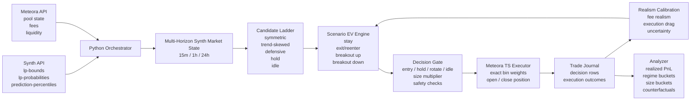

# AI Liquidity Optimizer


A probabilistic liquidity placement and market-making bot for Meteora DLMM, powered by Synth forecast data.

The project is focused on a single live strategy today:
- asset: `SOL`
- pool: `SOL/USDC`
- venue: `Meteora DLMM`
- position model: `one active position at a time`
- control loop: periodic rebalance / hold / idle decisions

The core idea is simple: concentrated liquidity is a probabilistic inventory and volatility problem, not just a static range-picking problem. This bot uses Synth's probabilistic market data to decide where to place liquidity, when to stay put, when to rotate, and when to do nothing.

## What The Bot Does

On each cycle, the bot:
1. pulls Synth market data
2. pulls Meteora pool state and fee data
3. builds a multi-horizon market state
4. scores candidate actions using scenario-based EV
5. applies realism calibration from realized on-chain outcomes
6. gates actions through safety and execution-health checks
7. either holds, idles, or executes a new Meteora DLMM position
8. writes a detailed decision row to the trade journal for later analysis

## Synth Data Used

The strategy consumes three Synth data products:
- `GET /insights/lp-bounds`
- `GET /insights/lp-probabilities`
- `GET /insights/prediction-percentiles`

Those inputs are used differently:
- `lp-bounds` provides candidate ranges, stay probability, expected time in range, and expected IL
- `lp-probabilities` provides distribution shape information used for breakout, one-sided inventory, and reentry estimates
- `prediction-percentiles` provides a forward price path distribution used for path-aware occupancy and exact bin weighting

The bot currently works with a fused horizon set of `15m`, `1h`, and `24h`.
When Synth does not expose `15m` `lp-bounds` directly, the bot synthesizes a short-horizon forecast from `prediction-percentiles` rather than dropping the short horizon entirely.

## Decision Engine

### 1. Multi-Horizon Market State

The strategy constructs a `SynthMarketState` from the available horizons and derives:
- fused center price
- fused width
- cross-horizon agreement score
- short-vs-medium conflict score
- width term expansion
- reentry probability
- one-sided breakout risk
- regime confidence

From that state, it labels the market as one of:
- `range`
- `trend_up`
- `trend_down`
- `uncertain`

### 2. Candidate Ladder

Instead of scoring a single static range, the bot builds a deterministic ladder of candidate actions such as:
- fused symmetric range
- trend-skewed range
- defensive wide range
- hold current range
- idle

### 3. Scenario-Based EV

Each candidate is scored across four Synth-derived scenarios:
- stay in range
- exit then reenter
- breakout up
- breakout down

The EV model tracks:
- expected fee capture
- expected impermanent loss
- expected active minutes before exit
- reentry probability
- directional inventory bias
- explicit rebalance and switching costs

### 4. Realized-First Calibration

Raw modeled EV is not trusted on its own.
The strategy applies a realism layer that learns from the trade journal and adjusts:
- fee realism
- rebalance drag
- model uncertainty

Important design choice:
- realism is `execution-only`
- non-execution cycles and mark-to-market noise do not train the calibration model

The calibration path is conservative by design:
- sparse data falls back to priors
- regime-specific calibration only blends in after enough samples
- obvious legacy execution accounting artifacts are excluded from calibration without deleting raw history

### 5. Staged Rollout

The Synth market-state layer supports three rollout stages:
- `shadow`: compute and log the new logic without changing live decisions
- `entry_size`: let regime-aware entry vetoes and position sizing affect live behavior
- `full`: let the full regime-aware candidate ladder and lifecycle policy control live actioning

## Execution Layer

The strategy core is Python-first, but live execution is delegated to a small Node bridge that uses the official Meteora TypeScript SDK.

That separation keeps the system clean:
- Python handles data fusion, scoring, journaling, and analysis
- Node handles DLMM-specific transaction building and execution

The live executor supports:
- opening a new weighted DLMM position
- closing an existing position
- exact bin-weight execution plans
- on-chain wallet snapshots and cycle-over-cycle delta capture

## Safety And Operational Guardrails

The live loop includes explicit safeguards:
- one-position-only state model
- untracked on-chain position detection
- capital sufficiency checks before entry
- executor-health gating
- action cooldowns
- hold / idle / rebalance gating based on adjusted EV, structure, and policy overrides

This keeps the bot from treating every positive modeled edge as executable alpha.

## Trade Journal And Analyzer

Every cycle is written to `state/trade_journal.jsonl`.
The journal records:
- selected action
- raw and adjusted EV
- fee / IL / cost decomposition
- market regime
- agreement score
- reentry probabilities
- size multiplier
- candidate family
- counterfactual alternatives
- execution status
- realized execution deltas
- calibration inclusion / exclusion state

The analyzer script can summarize:
- execution realized P/L
- calibration drift
- regime-level behavior
- size-bucket behavior
- counterfactual winner frequency
- error categories
- timing vs fees / IL

## Repository Layout

```text
ai-liquidity-optimizer/
├── src/ai_liquidity_optimizer/
│   ├── clients/              # Synth and Meteora API clients
│   ├── execution/            # Python execution interfaces and bridges
│   ├── strategy/             # Scoring, realism, and Synth market-state logic
│   ├── cli.py                # CLI entrypoint
│   ├── config.py             # Environment-driven settings
│   ├── models.py             # Shared strategy and transport models
│   └── orchestrator.py       # Main live decision loop
├── executors/meteora_ts/     # Node / TypeScript Meteora executor
├── scripts/                  # Analysis and handoff scripts
├── tests/                    # Unit test suite
├── state/                    # Local runtime state and trade journal
├── .env.example
├── requirements.txt
├── pyproject.toml
└── README.md
```

## Quick Start

### Prerequisites

- Python `3.9+`
- Node `20.x`
- a valid `SYNTH_API_KEY`
- for live execution: Solana RPC access and a funded wallet

### Dry Run

```bash
python3 -m venv .venv
source .venv/bin/activate
pip install -r requirements.txt
cp .env.example .env
PYTHONPATH=src python3 -m ai_liquidity_optimizer --env-file .env --once
```

### Continuous Local Run

```bash
PATH="/opt/homebrew/opt/node@20/bin:$PATH" \
PYTHONPATH=src \
python3 -m ai_liquidity_optimizer --env-file .env
```

### Live Meteora Execution

In `.env`, set at minimum:
- `EXECUTOR=meteora-node`
- `SOLANA_RPC_URL`
- `SOLANA_PRIVATE_KEY_B58`
- `DEPOSIT_SOL_AMOUNT`
- `DEPOSIT_USDC_AMOUNT`

Install the Node executor dependencies:

```bash
cd executors/meteora_ts
npm ci --omit=dev
cd ../..
```

Then run:

```bash
PATH="/opt/homebrew/opt/node@20/bin:$PATH" \
PYTHONPATH=src \
python3 -m ai_liquidity_optimizer --env-file .env --once
```

## Useful Config

Core runtime:
- `REBALANCE_INTERVAL_MINUTES`
- `RANGE_CHANGE_THRESHOLD_BPS`
- `STATE_PATH`
- `TRADE_JOURNAL_PATH`
- `EXECUTOR`

Synth market-state rollout:
- `SYNTH_FUSION_HORIZONS`
- `SYNTH_MARKET_STATE_STAGE`
- `SYNTH_REGIME_*`
- `SYNTH_SIZE_*`

Realism and calibration:
- `EV_REALISM_*`
- `EV_CALIBRATION_MAX_REALIZED_POSITION_FRACTION`
- `EV_CALIBRATION_MAX_ERROR_POSITION_FRACTION`
- `EV_CALIBRATION_MAX_ERROR_MODEL_SCALE_MULTIPLE`

Execution hygiene:
- `EXECUTION_HEALTH_*`

## Analyze Results

Analyze the last 24 hours:

```bash
PYTHONPATH=src python3 scripts/analyze_trade_journal.py \
  --path state/trade_journal.jsonl \
  --since-hours 24 \
  --show-errors 10
```

Export CSV:

```bash
PYTHONPATH=src python3 scripts/analyze_trade_journal.py \
  --path state/trade_journal.jsonl \
  --since-hours 24 \
  --csv-out state/trade_cycle_metrics.csv
```

## Current Scope And Limitations

This is a focused hackathon system, not a generalized production MM platform.

Current intentional constraints:
- SOL/USDC only
- one active position only
- one venue only
- no UI
- relies on local state and journal persistence
- still gathering live realized execution samples for the newer regime-aware controls

## Why This Project Is Interesting

Most LP range tools are static and backward-looking.
This project treats liquidity placement as a live probabilistic control problem:
- use Synth to model path risk, not just spot drift
- reason about reentry and breakout states explicitly
- learn from realized execution outcomes instead of trusting model EV blindly
- turn probabilistic forecasts into live on-chain actioning

That is the core thesis of the system.

